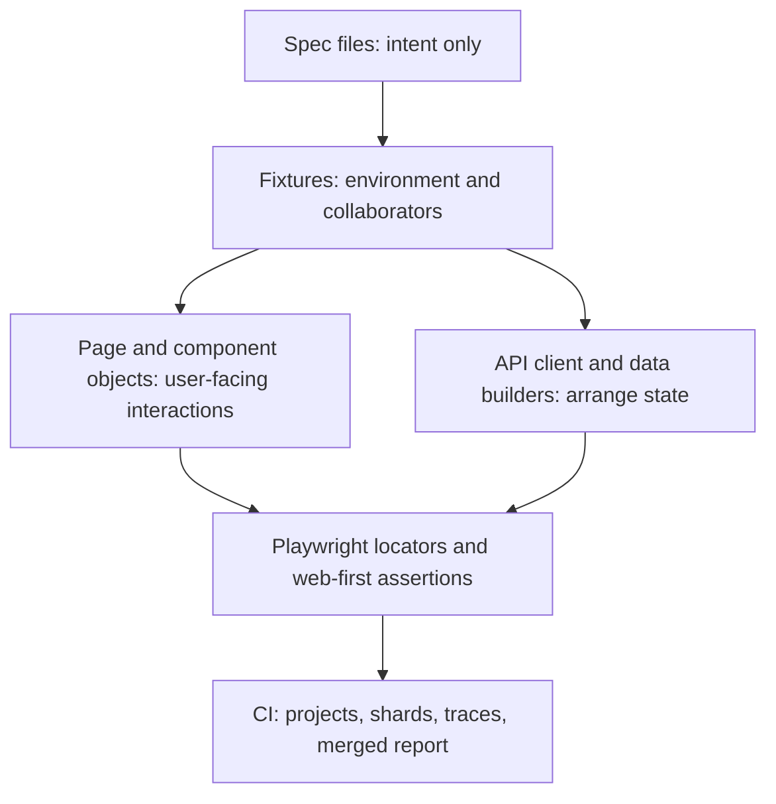

## Other versions

This Markdown file is the source. Two HTML renderings sit beside it in
`learn/`:

- [playwright-typescript-interview-prep.html](playwright-typescript-interview-prep.html)
  is the study version. It adds a contents index and a Playwright basics
  section ahead of the question bank, and collapses every answer so the
  questions can be used for self testing.
- [playwright-typescript-interview-prep-plan.html](playwright-typescript-interview-prep-plan.html)
  is this plan rendered exactly as written, with no added sections and no
  reordering.

## How to use this plan

This plan is written for one specific person: a QA engineer with roughly nine
years in testing, deep strength in test process, test management and API
testing, solid Selenium WebDriver history, and newer hands-on Playwright and
TypeScript work. The resume already states TypeScript and Playwright UI
automation at Resurs Bank, so interviewers will probe at the level of someone
who has lived with a Playwright suite for a couple of years.

The goal is not to memorise answers. The goal is to make the claim true at
depth: build a real framework, hit real failures, and be able to explain
every decision out loud with a trade-off attached.

Three rules while working through this plan:

- Never state an experience you did not have. Convert every gap into either
  "I have not used that; here is the closest thing I have done and how I would
  approach it" or into real practice in the proof project before the interview.
- Every topic is learned twice: once by reading, once by breaking something and
  fixing it. Only the second pass survives follow-up questions.
- Record a one-paragraph answer out loud for every question you cannot answer
  fluently. Fluency, not coverage, is what reads as experience.

## Where you stand today

Taken from the approved base resume and evidence file, not from assumption.

Strong and interview-ready already:

- End-to-end QA ownership: requirements through test design, test data, manual
  execution, defect management and release validation.
- Test management tooling: Jira, Xray, TestRail, Confluence.
- API testing breadth: REST, SOAP, Bruno, RestAssured, Postman, SoapUI, Karate,
  OpenAPI, microservices.
- Selenium WebDriver with Java, TestNG, Page Object Model, parallel execution,
  Jenkins pipelines, cross-browser on Chrome, Firefox and Safari.
- CI/CD execution with GitHub Actions and Jenkins, plus k6 performance testing.
- Regulated-domain testing: AML/KYC, sanctions, PEP/RCA, eID/BankID.
- On-call incident investigation, log reading and defect narrowing.

Claimed on the resume and therefore fair game for deep questioning:

- A TypeScript and Playwright UI automation framework for regression and
  accessibility testing across customer-onboarding flows.
- Playwright running in CI/CD pipelines with coverage reporting.
- Cypress suites during the freelance period.
- AI-assisted QA with GitHub Copilot and Claude Code, custom agents and skills.

Likely weak points to close before interviews:

- TypeScript as a language rather than as "JavaScript with types": generics,
  unions, type narrowing, structural typing, declaration merging.
- Playwright fixtures as an architecture, not just `beforeEach` replacement.
- Deliberate flakiness diagnosis using traces rather than retries.
- Sharding, blob reports and report merging at scale.
- Network interception and mocking as a test-design tool.
- Newer surface area: aria snapshots, clock control, test locks, Playwright
  test agents.

## The interviewer's mental model

An engineer with two solid Playwright years is expected to answer differently
from a beginner in five specific ways. Aim every answer at these:

1. They talk about **locators and auto-waiting as a design contract** with
   developers, not as syntax.
2. They talk about **fixtures and projects** when asked about structure, not
   about base classes and inheritance.
3. They treat **flakiness as a diagnosable defect**, name the category, and
   reach for the trace before the retry count.
4. They can explain **CI economics**: workers, shards, browser downloads,
   run time, artifact size, and what they cut when the pipeline got slow.
5. They have **opinions with trade-offs**. "It depends" followed by the actual
   deciding factor is a senior answer; "it depends" alone is not.

Everything below is organised to produce those five behaviours.

## Strategic approach: four tracks

Run these tracks in parallel rather than sequentially. Each interview question
tends to pull from more than one.

### Track A: language fluency

TypeScript to the point where you can read an unfamiliar fixture file and
explain what the types are doing. Async/await semantics deeply enough to
explain why a missing `await` produces a silently passing test.

### Track B: framework craft

Design, build and refactor a real Playwright framework. The refactor matters
more than the build: interviewers ask "what would you change", and only someone
who has already changed it answers well.

### Track C: failure forensics

Deliberately create flaky and failing tests, then diagnose them with traces,
UI mode and the reporter output. Build a personal taxonomy of failure causes.

### Track D: narrative and process

Convert your real Resurs Bank, Model N and Bookwow experience into short,
specific, honest stories. Pair your test-management strength with Playwright
so you are not competing only on tool depth, where you are newer, but on
quality ownership, where you are strong.

## Tactical plan: five phases with exit criteria

Adjust the pace to your availability. Do not move on until the exit criterion
is met, because the exit criteria are what interviewers actually test.

### Phase 1: TypeScript that survives follow-up questions

Study:

- Structural typing, `interface` versus `type`, unions and intersections.
- Generics, including generic constraints and why `test.extend<T>` needs them.
- Type narrowing, discriminated unions, `unknown` versus `any`.
- `strict` mode, `strictNullChecks`, optional chaining and nullish coalescing.
- Promises: `async`/`await`, `Promise.all`, floating promises, error
  propagation, why `expect(await locator.isVisible()).toBe(true)` is a bug.
- Modules, path aliases via `tsconfig.json`, and `tsc --noEmit` as a CI gate.
- ESLint with `@typescript-eslint/no-floating-promises`.

Do:

- Convert one of your existing JavaScript or Java test helpers into strict
  TypeScript, with no `any`.
- Write a typed test-data builder that uses generics and a union type for
  customer risk categories, mirroring your AML/KYC domain.

Exit criterion: you can explain, without notes, why Playwright's `test.extend`
takes two type parameters and what happens to types when you call
`mergeTests`.

### Phase 2: Playwright fundamentals with the "why"

Study:

- Architecture: Playwright drives browsers out of process over a single
  connection, which is why it can control multiple contexts, intercept
  network below the page, and is not bound to the page's JavaScript loop the
  way an in-browser runner is.
- Browser, browser context, page. Why context is the isolation unit and why
  that makes parallel tests cheap.
- Locators as lazy queries re-resolved on every action, auto-waiting through
  actionability checks, and strict mode.
- Locator priority: role, label, placeholder, alt text, title, test id, and
  CSS or XPath only as a last resort.
- Chaining, `filter`, `and`, `or`, `visible`, `nth`, `first`, `last`.
- Web-first assertions versus plain assertions; `expect.poll`, `expect.toPass`,
  `expect.soft`, `expect.configure`, custom matchers via `expect.extend`.

Do:

- Take one Selenium test you know well and rewrite it in Playwright, then
  write down every explicit wait you deleted and why it was no longer needed.
- Break strict mode on purpose. Read the error. Fix it three different ways
  (filter, chaining, better role name) and decide which you would defend.

Exit criterion: you can list the actionability checks Playwright performs
before a click and explain what "stable" means for an animating element.

### Phase 3: framework architecture

Study:

- Fixtures: test scope versus worker scope, `auto`, `option`, fixture
  timeouts, `box`, custom titles, execution and teardown order, `mergeTests`.
- Page Object Model in a fixture-based world: objects as collaborators
  supplied by fixtures rather than instantiated in hooks.
- Projects: browser matrix, `dependencies`, `teardown`, per-project `use`.
- Authentication: a setup project that logs in once and saves `storageState`;
  worker-scoped accounts when tests mutate user state.
- Configuration: `baseURL`, `webServer`, timeouts at test, expect, action and
  navigation level, `testIdAttribute`, `snapshotPathTemplate`, `tsconfig`.
- Test data strategy: seed through the API, derive unique identifiers per test,
  clean up in fixture teardown, never share mutable records.
- Tags and annotations for smoke, regression and risk-based selection, mapping
  back to the Xray and Jira process you already run.

Do: build the proof project described below.

Exit criterion: you can draw your framework's layering on a whiteboard in
under two minutes and justify each seam.

### Phase 4: reliability, CI and forensics

Study:

- Parallelism model: files in parallel by default, tests in a file in order,
  `fullyParallel`, `workers`, serial mode and why it is discouraged, test
  locks for shared resources.
- Worker index and parallel index for data isolation.
- Retries, retry strategies, `maxFailures`, `failOnFlakyTests`.
- Trace modes, especially `on-first-retry` and the retain-on-failure variants,
  and why tracing everything is expensive.
- Trace viewer: timeline, DOM snapshots before and after each action, network
  panel, console, source, attachments.
- UI mode and watch mode for authoring; codegen and the VS Code extension for
  locator picking, not for producing final tests.
- Reporters: list, line, dot, html, junit for your existing reporting chain,
  blob plus `merge-reports` for sharded runs.
- Sharding across machines, and installing only the browsers you need on CI.
- Docker image usage and OS consistency for visual comparisons.

Do:

- Deliberately introduce five flaky tests, one per category: a race with a
  re-rendering list, a shared backend record, an animation, a time-dependent
  assertion, and an unmocked third-party call. Fix each one properly.
- Run your suite sharded across a matrix, produce blob reports, merge them
  into a single HTML report, and publish it as a CI artifact.

Exit criterion: given a failing trace, you can narrate the diagnosis out loud
in the order a senior engineer would: what the test intended, what the DOM
showed at the failing action, what the network did, then the fix.

### Phase 5: breadth, depth and rehearsal

Study:

- Network: `page.route`, `route.fulfill`, `route.fetch`, `route.fallback`,
  `route.abort`, `routeFromHAR`, WebSocket routing.
- API testing inside Playwright: the `request` fixture versus `page.request`
  and the cookie-sharing difference; using the API to arrange state and the UI
  only to assert user-visible behaviour.
- Accessibility: axe-core through `@axe-core/playwright`, plus aria snapshots
  and the accessible-name assertions. Note that the old `page.accessibility`
  API was removed, so an answer referencing it dates you.
- Visual comparison: `toHaveScreenshot`, masking, `maxDiffPixels`, animation
  disabling, and why golden images must be generated on the same OS as CI.
- Clock control for time-dependent flows such as session expiry and cut-off
  times, which maps directly to banking scenarios.
- Emulation: viewport, locale, timezone, geolocation, colour scheme, reduced
  motion, forced colours.
- Component testing at a conceptual level, and where the boundary sits between
  component tests and end-to-end tests.
- Current release surface: test locks, visible-only locators, aria and screen
  snapshots in traces, and the Playwright test agents for planning, generating
  and healing tests.

Do:

- Run at least three full mock interviews using the question bank below,
  recorded, then re-listen and cut every filler sentence.

Exit criterion: no question in the bank produces a blank pause.

## The proof project

Build one framework you can open on a screen share and defend line by line.
Use a public application so nothing confidential is involved. Good targets are
the Playwright TodoMVC demo, a public sandbox shop such as the Sauce Labs demo
site, or a small app you host yourself.

Suggested shape:

```text
playwright-demo/
  playwright.config.ts
  tsconfig.json
  eslint.config.js
  src/
    fixtures/
      base.fixtures.ts      # merges app, api and a11y fixtures
      auth.fixtures.ts      # worker-scoped account, storageState
      a11y.fixtures.ts      # axe wrapper as an auto fixture
    pages/
      login.page.ts
      onboarding.page.ts
      components/
        data-table.component.ts
    api/
      client.ts             # typed APIRequestContext wrapper
      builders/customer.ts  # generic, typed test-data builders
    utils/
      env.ts                # typed config loading, no secrets in repo
  tests/
    auth.setup.ts
    smoke/
    regression/
    a11y/
  .github/workflows/e2e.yml
```

Layering to be able to draw:



Deliberate decisions to make, because each one is an interview question:

- Assertions in specs, not in page objects, so a failing test reads as intent.
  Be ready to argue the opposite position too.
- Data setup through the API, never through the UI, except when the signup UI
  is itself under test.
- A setup project producing `storageState`, with worker-scoped accounts for
  tests that mutate profile data.
- Test ids agreed with developers as a contract, with role-based locators
  preferred wherever the accessible name is stable.
- `fullyParallel` on, serial mode nowhere, a named lock only where a genuinely
  shared resource exists.
- Traces on first retry, video off by default, screenshots only on failure.
- Smoke tagged and run on every pull request; full regression sharded nightly.
- `tsc --noEmit` and ESLint as pipeline gates before tests run.

Then do the part most candidates skip: write a short `DECISIONS.md` in that
project listing each choice, the alternative you rejected, and why. Interview
answers fall out of that file almost verbatim.

## Interview question bank

For each block: the question, what is actually being tested, and the spine of
a strong answer. Practise answering in sixty to ninety seconds, then stop and
offer to go deeper.

### TypeScript

**Why TypeScript for test automation rather than plain JavaScript?**

- Tested: whether you chose the language or inherited it.
- Spine: compile-time feedback on page-object and fixture contracts, IDE
  discoverability of the Playwright API, safe refactoring across a large
  suite, and typed test data that prevents invalid states. Cost: build
  configuration and a learning curve for manual testers joining the suite.

**What is the difference between `interface` and `type`?**

- Spine: interfaces are open to declaration merging and read naturally for
  object shapes; type aliases express unions, intersections, mapped and
  conditional types. Team convention matters more than the distinction; pick
  one and be consistent.

**Where have you used generics in a test framework?**

- Spine: typed API client where the response type is a parameter, typed data
  builders, and `test.extend<TestFixtures, WorkerFixtures>` where the two
  parameters separate test-scoped from worker-scoped fixture types.

**What goes wrong if you forget an `await` in a Playwright test?**

- Spine: the promise floats, the assertion or action is never awaited, the
  test can pass while doing nothing, and failures surface later as unhandled
  rejections in an unrelated test. Prevention: the
  `@typescript-eslint/no-floating-promises` rule plus `tsc --noEmit` in CI.

**`unknown` versus `any`?**

- Spine: `any` disables checking and spreads; `unknown` forces narrowing
  before use. Parse API responses into `unknown` and narrow, or type the
  request call generically.

Quick-fire: optional chaining and nullish coalescing; `readonly` and `as
const`; enum versus union of string literals; utility types such as `Partial`,
`Pick`, `Omit` and `Record`; why `Promise.all` on locator actions is usually
wrong; how `tsconfig` path aliases are picked up by the test runner.

### Playwright fundamentals

**How does Playwright differ architecturally from Selenium WebDriver, and
from Cypress?**

- Tested: whether you understand the tools or repeat marketing lines.
- Spine: Selenium speaks the W3C WebDriver protocol to a driver per browser;
  Playwright drives browsers directly over a single persistent connection
  with browser-specific protocols, which enables cheap contexts, network
  interception below the page, and built-in auto-waiting. Cypress executes in
  the browser alongside the app, which gives excellent debugging but
  historically constrains multi-origin, multi-tab and cross-browser work.
  Selenium's strength remains language and grid ecosystem breadth. Because you
  have shipped in all three, say which you would pick for which context.

**Explain browser, context and page.**

- Spine: one browser process, many contexts, each context an isolated
  incognito-like profile with its own cookies, storage and permissions, each
  context holding one or more pages. Contexts are why test isolation is cheap
  and why parallel workers do not leak state.

**What is a locator and why is it better than storing an element reference?**

- Spine: a locator is a lazy description re-resolved immediately before every
  action, so a re-rendered DOM does not produce a stale element error. An
  element handle points at one node at one moment.

**What does Playwright wait for before it clicks?**

- Spine: actionability checks. The element must be attached and visible,
  stable meaning it has stopped moving between animation frames, able to
  receive events meaning nothing overlays the hit point, and enabled. For
  typing it must also be editable. If any check fails, Playwright retries
  until the action timeout and the error log shows which check blocked.

**What is strict mode and how do you resolve a violation?**

- Spine: any action on a locator matching more than one element throws. Fix by
  narrowing with a role plus accessible name, by chaining within a container,
  or by `filter`. Reaching for `first()` or `nth()` is an admission that the
  locator does not express intent; acceptable for genuinely ordinal lists.

**Locator strategy, in priority order, and why?**

- Spine: role with accessible name first, because it matches what users and
  assistive technology perceive and it doubles as a light accessibility check.
  Then label, placeholder, alt text, title. Then test ids as an explicit
  contract negotiated with developers. CSS last, XPath effectively never,
  because both couple tests to DOM structure. Mention that the test id
  attribute is configurable via `testIdAttribute`.

**Web-first assertions versus plain assertions?**

- Spine: `expect(locator).toBeVisible()` polls and retries until the expect
  timeout; `expect(value)` evaluates once. The classic anti-pattern is
  `expect(await locator.isVisible()).toBe(true)`, which samples a single
  instant. For non-locator conditions use `expect.poll` or `expect.toPass`.

**When do you use soft assertions?**

- Spine: when you want the full picture from one run, for example validating
  many fields on a summary page, or an accessibility sweep. Never for
  preconditions, because continuing after a failed precondition produces
  misleading downstream failures.

Quick-fire: `toHaveText` versus `toContainText`; asserting on a list with an
array argument; `toHaveCount`; `toBeAttached` versus `toBeVisible`;
`toBeInViewport`; `expect.configure` for a slower assertion timeout;
`locator.describe` for readable traces; shadow DOM support and the XPath
exception; `frameLocator` for iframes.

### Framework design

**Walk me through the structure of your Playwright framework.**

- Tested: whether the structure is reasoned or copied.
- Spine: specs express intent only; fixtures supply the environment and
  collaborators; page and component objects hold interaction knowledge;
  an API client arranges state; config holds the project matrix and timeouts.
  Name one thing you would change today and why. Use the proof project and the
  real Resurs Bank suite as your two reference points, being explicit about
  which is which.

**Fixtures or `beforeEach` hooks?**

- Spine: fixtures keep setup and teardown in one place, are reusable across
  files, are created only when a test asks for them, compose with each other,
  and are type safe. Hooks are fine for trivial shared navigation. Worker
  fixtures exist for anything expensive enough to create once per worker.

**Give an example of a worker-scoped fixture you would write.**

- Spine: a per-worker test account derived from the worker index, created in
  setup and deleted in teardown, so parallel tests never fight over the same
  customer record. Note that a worker fixture has its own timeout and that
  workers restart after a failure.

**How do you handle authentication?**

- Spine: a setup project that logs in once, saves `storageState` to a file,
  and is declared as a dependency of the browser projects, so every test starts
  authenticated without repeating the login flow. Where tokens live in
  IndexedDB rather than cookies, save that too. For tests that mutate account
  state, a per-worker account instead of one shared login. Keep a small number
  of tests that exercise the real login UI, because storage state bypasses it.

**Do page objects contain assertions?**

- Spine: state your position and the trade-off. Assertions in specs make
  failures read as violated intent and keep page objects reusable; assertions
  in page objects reduce duplication for repeated compound checks. A common
  middle ground is exposing locators and small query methods from the page
  object and asserting in the spec, with a few named verification helpers.

**How do you keep a large suite maintainable?**

- Spine: shared locator contract with developers, component objects for
  repeated widgets, fixtures instead of inheritance, tags for selection, a
  naming convention tied to requirements so coverage maps back to Jira and
  Xray, a review rule that every new test declares its level and its data
  needs, and a periodic pass on the slowest and flakiest tests.

**How do you decide what belongs in an end-to-end test at all?**

- Spine: the classic shape argument, expressed as risk. End-to-end tests cover
  user journeys that cross services and have business or regulatory
  consequence, for example onboarding with screening. Field validation, edge
  cases and permutations belong at API or component level where they run in a
  fraction of the time. This is where your test-management background is your
  strongest differentiator, so do not answer this one purely as a tool user.

Quick-fire: `test.use` for per-file options; option fixtures with `option:
true` for parameterised projects; `mergeTests` and `mergeExpects`; `box: true`
to hide helper noise in reports; auto fixtures as global before and after
hooks; project `dependencies` and `teardown`; `snapshotPathTemplate`.

### Reliability and flakiness

**A test passes locally and fails on CI. Walk me through your process.**

- Tested: forensic discipline. This is the single most predictive question.
- Spine: reproduce from evidence first, not from guesses. Open the trace from
  the failing run, find the failing action, compare the DOM snapshot before
  and after, check the network panel for a pending or failed call, check the
  console for application errors. Then classify: environment difference,
  timing, data collision, test pollution, or a genuine product defect. Fix the
  cause. Retries are a safety net for infrastructure noise, never a fix, and a
  test retried repeatedly should be quarantined and tracked as a defect.

**Name the categories of flakiness you have actually hit.**

- Spine: DOM races on re-render; shared mutable test data; animations and
  transitions; time-dependent logic such as session expiry and cut-off times;
  unstubbed third-party calls and cookie banners; test ordering dependencies;
  resource contention from too many workers on a small CI runner; expired
  authentication state; network latency differences between local and CI.

**How do you handle an overlay or cookie banner that appears unpredictably?**

- Spine: `addLocatorHandler` registers a handler that dismisses the interstitial
  whenever it appears and then continues, with a `times` limit. Better still,
  suppress it at source with a cookie or route stub so the test does not spend
  time on it at all.

**How do you test time-dependent behaviour?**

- Spine: the clock API. Install a fixed time, let the page load, fast-forward
  or pause at a specific instant, then assert. This removes sleeps entirely
  from session-timeout, cut-off-time and scheduled-task scenarios, which is
  directly relevant to banking flows.

**Two tests both edit the same customer. What do you do?**

- Spine: first choice is to give each test its own data, derived from the test
  id or created per test through the API. If the resource is genuinely
  singular, such as a global setting or an external sandbox, declare a named
  lock so those tests never run concurrently while everything else stays
  parallel. Serial mode is a last resort because a failure skips the rest of
  the group.

**How do you stop tests leaking state into each other?**

- Spine: each test gets its own browser context by default, so cookies and
  storage are already isolated. The leaks that remain are outside the browser:
  backend records, files written to a shared path, and module-level variables.
  Use per-test identifiers, `testInfo.outputPath` for files, and never hold
  state in module scope.

### CI, scale and reporting

**How do you run Playwright in CI?**

- Spine: Linux runners, `npx playwright install --with-deps` limited to the
  browsers actually needed or the official Docker image, type-check and lint
  gates first, smoke suite on every pull request, full regression sharded on a
  schedule, traces on first retry, HTML report and traces published as
  artifacts, and a results feed into the test-management tool. Tie this to the
  GitHub Actions and Jenkins pipelines you have already run.

**Your suite takes too long. What do you do, in order?**

- Spine: measure first, using the report's slowest-test view rather than
  intuition. Then: remove waits and sleeps; move coverage down the stack from
  UI to API; arrange state through the API instead of the UI; enable full
  parallelism; tune worker count against runner CPU; shard across machines;
  cut redundant cross-browser runs to the risk-justified minimum; cache
  dependencies and browsers; disable video and trace-everything modes.

**How do you get one report out of a sharded run?**

- Spine: each shard emits a blob report, the shards upload their blobs as
  artifacts, and a final job merges them with `merge-reports` into a single
  HTML report. Mention that the merged report can group by file and shows a
  timeline.

**Workers, shards and `fullyParallel`. Explain the difference.**

- Spine: workers are parallel processes on one machine; `fullyParallel` allows
  tests within a single file to spread across workers rather than running in
  declaration order; sharding splits the suite across separate machines. They
  compose: shards multiply the worker count available.

**Which reporters do you use and why?**

- Spine: `list` or `line` locally, `html` for humans, `junit` for pipeline and
  test-management integration, `blob` for sharded runs. If your process feeds
  Xray, describe how results map back to test cases and executions, because
  that is your strong ground.

**How do you report quality status to stakeholders?**

- Spine: this is where you lead with your nine years. Automated pass rate is
  not quality. Talk about coverage against requirements, risk areas, defect
  trends by severity, flaky-test debt, and release readiness with explicit
  known risks. You maintained a quality metrics matrix at Model N; use it.

### API, network and data

**When do you test through the API instead of the UI?**

- Spine: whenever the assertion does not depend on rendering. Use the API to
  create customers, seed screening results and reach the state under test, then
  use the UI to assert what a user sees. Faster, less brittle, and it keeps
  end-to-end tests focused on integration risk.

**Difference between the `request` fixture and `page.request`?**

- Spine: `page.request` shares the page context's cookies and storage state, so
  it acts on behalf of the logged-in user; the standalone `request` fixture is
  an isolated context, which is what you want for pure API tests or for
  arranging state before a browser exists.

**How do you mock a third-party dependency?**

- Spine: route the URL pattern and fulfil with a controlled response. For a
  partial change, fetch the real response inside the handler, modify the JSON
  and fulfil with it. For a large surface, record a HAR once and replay it.
  Rationale: you only test what you own; an unstable external sandbox causes
  failures that teach you nothing.

**You have Bruno and RestAssured suites already. Why put API calls in
Playwright too?**

- Spine: different purposes. The dedicated API suites own contract and
  behaviour coverage. Playwright's request context exists to arrange and verify
  state around UI journeys. Duplicating full API coverage inside the UI suite
  would be waste. This is a strong, honest answer that shows judgement rather
  than tool enthusiasm.

**How do you manage test data for a regulated domain?**

- Spine: synthetic data only, never production personal data; typed builders
  producing valid-by-construction records; per-test or per-worker uniqueness;
  cleanup in fixture teardown; secrets from the CI secret store and never from
  the repository; and specific scenario fixtures for screening outcomes such as
  a sanctions hit or a PEP match.

### Accessibility, visual and emulation

**Your resume mentions accessibility testing. How do you actually do it?**

- Tested: whether the claim holds. Answer precisely and within your evidence.
- Spine: automated scanning with axe-core through the Playwright integration,
  run per key page or per state, with violations attached to the test report.
  Be clear that automated scanning catches only a portion of issues and that
  keyboard navigation, focus order and screen-reader checks remain manual.
  Role-based locators and accessible-name assertions give continuous low-level
  feedback. Aria snapshots assert the accessibility tree structure. Note that
  the old built-in accessibility API was removed, so axe is the current route.

**How do visual comparisons work and when are they worth it?**

- Spine: `toHaveScreenshot` captures, waits for stabilisation, and compares
  against a golden image with a configurable pixel tolerance, masking dynamic
  regions. Worth it for design systems and high-value layouts; expensive
  elsewhere because goldens must be generated on the same OS and browser as
  CI, which usually means generating them in the Docker image or in a CI job.

**What can you emulate?**

- Spine: viewport and device descriptors, locale and timezone, geolocation,
  permissions, colour scheme, reduced motion, forced colours and contrast, and
  offline state. Locale and timezone matter for the Nordic markets; reduced
  motion and forced colours matter for accessibility coverage.

### Process, leadership and collaboration

**How do you decide what to automate?**

- Spine: risk and repetition. Regulatory and money-path flows first, then
  high-frequency regression, then stable high-value journeys. Do not automate
  unstable features, one-off exploratory findings, or anything where the
  maintenance cost exceeds the manual cost.

**How do you introduce Playwright into a team that uses something else?**

- Spine: start with a thin vertical slice on a single high-value journey,
  prove it in the pipeline, measure run time and failure signal quality
  against the incumbent, keep both suites running during migration, migrate by
  risk order rather than alphabetically, and invest early in developer
  onboarding so the suite does not become one person's property.

**A developer says your test is flaky and the feature is fine. How do you
respond?**

- Spine: agree to be evidence-led rather than defensive. Open the trace
  together. Often it is a real race condition that users would hit
  occasionally, which turns the conversation into a shared defect rather than a
  test problem. If it is the test, fix it and say so plainly.

**How do you work with developers on testability?**

- Spine: negotiate stable test ids and accessible names as a contract, ask for
  seeding endpoints and feature flags, get deterministic hooks for time and
  randomness, and review pull requests for testability rather than only for
  test code. Cite the on-call work: reading logs alongside developers is the
  same collaboration muscle.

**Tell me about a time you found a critical defect late.**

- Spine: use a real situation, state the impact plainly, then focus on what
  changed in the process afterwards. Avoid blame and avoid inventing numbers
  you cannot support.

### Scenario and whiteboard

Expect at least one of these. Practise them out loud.

- Design an automation strategy for a customer-onboarding flow with identity
  verification, document upload and an external screening call.
- You inherit a suite with four hundred tests, a forty per cent flake rate and
  a ninety-minute run. What do you do in the first two weeks?
- The team wants to run end-to-end tests against production. Argue for and
  against, then propose a safe subset.
- Design tests for a file upload with a progress bar and an asynchronous
  virus-scan result.
- A page shows data from three services; one is slow and sometimes times out.
  How do you make the test deterministic without hiding the real risk?

### Live coding drills

Interviewers commonly ask for one of these on a screen share. Practise each
until you can do it without documentation.

- Write a test for a login form using role-based locators and web-first
  assertions, including a negative case.
- Convert a test that uses `waitForTimeout` into one with no explicit waits.
- Write a fixture that provides a logged-in page and explain its teardown.
- Write a worker-scoped fixture that creates and deletes a test account.
- Intercept an endpoint and return a fixed JSON payload, then assert the empty
  state and the error state of the same component.
- Assert on a dynamic table: row count, one specific row selected by its text,
  and a button inside that row.
- Write a custom matcher with `expect.extend`.
- Write the `playwright.config.ts` for a three-browser matrix with an auth
  setup project, and explain every option you set.

### Questions to ask them

Asking good questions is part of sounding experienced.

- What does the current suite's run time and flake rate look like, and who
  owns it?
- How do developers and testers split responsibility for end-to-end tests?
- Is there a test id contract with the front-end team, or is it ad hoc?
- How do test results feed release decisions?
- What is the hardest thing to test in this product right now?

## Things that will cost you the interview

Avoid saying any of these, and correct them if they slip out:

- "I add `waitForTimeout` when the page is slow." Say auto-waiting, web-first
  assertions, `expect.poll` and route waiting instead.
- "I mostly use XPath because it is more powerful." This dates you and signals
  brittle suites.
- "We just increase retries when tests are flaky."
- "Playwright is faster than Selenium." Say why: fewer round trips, cheap
  contexts, built-in waiting, parallel workers by default.
- "Our automation gives us full coverage." Coverage claims without a basis are
  the fastest way to lose a senior interviewer.
- Inflating your Playwright history. If asked how long, give the real answer
  and immediately pivot to depth: the framework you built, the problems you
  solved, and the nine years of test judgement behind it.

## Handling the experience gap honestly

You will likely be asked how long you have used Playwright. Prepare one calm,
truthful sentence followed by evidence of depth. The structure that works:

1. State the real scope of your Playwright work plainly.
2. Immediately give a concrete artefact: the framework, what it covers, how it
   runs in the pipeline, and one hard problem you solved in it.
3. Bridge to the longer arc: nine years of test design, risk analysis, test
   management and API testing, plus Selenium and Cypress, which is why the
   tooling transfer was fast.
4. Close with current learning: name something specific you are working on
   now, such as aria snapshots or sharded reporting. Curiosity that is
   specific reads as genuine; "I love learning new things" does not.

Never claim a tool, version or feature you have not touched. If you have read
about it but not used it, say exactly that and then describe how you would
apply it. Interviewers respect that far more than a bluff that collapses on
the follow-up question.

## Story bank

Prepare five stories, each under two minutes, each anchored in something that
actually happened. Draft them in a private file, one per heading:

1. **Building the Playwright and TypeScript suite.** Why it was needed, how you
   structured it, the hardest technical problem, the outcome.
2. **Adopting an unfamiliar tool under delivery pressure.** The k6 performance
   framework is a ready-made example of learning fast and shipping.
3. **A defect you caught that mattered.** Preferably in a screening,
   onboarding or identity flow, described without exposing confidential detail.
4. **A disagreement you resolved with evidence.** The developer-and-flaky-test
   pattern, or a scope disagreement resolved with risk analysis.
5. **Improving a process, not just a test.** The quality metrics matrix, the
   Xray workflow, or the CI integration of automation results.

For each, keep the shape: situation, your specific action, the result, and one
sentence on what you would do differently. Keep numbers only where you can
support them.

## Self-assessment rubric

Score yourself honestly before each mock interview. Anything below three needs
another pass.

| Area | 1 | 3 | 5 |
| --- | --- | --- | --- |
| TypeScript | Reads code | Writes typed fixtures | Explains generics and narrowing |
| Locators | Uses them | Chooses by priority | Negotiates a locator contract |
| Waiting | Knows auto-wait | Never writes sleeps | Explains actionability checks |
| Fixtures | Uses built-ins | Writes custom ones | Designs scopes and teardown order |
| Config | Edits it | Sets projects and deps | Justifies every option |
| Flakiness | Retries | Diagnoses with traces | Names causes and prevents them |
| CI | Runs a pipeline | Shards and merges reports | Tunes cost and run time |
| Network | Knows routing | Mocks confidently | Designs test isolation around it |
| Strategy | Follows a plan | Applies risk-based selection | Leads the quality conversation |

## Resources

Primary source first. The official documentation is the single best
preparation material and is also what interviewers themselves read.

Playwright core reading:

- [Getting started](https://playwright.dev/docs/intro)
- [Best practices](https://playwright.dev/docs/best-practices)
- [Locators](https://playwright.dev/docs/locators)
- [Auto-waiting and actionability](https://playwright.dev/docs/actionability)
- [Assertions](https://playwright.dev/docs/test-assertions)
- [Isolation and browser contexts](https://playwright.dev/docs/browser-contexts)
- [Fixtures](https://playwright.dev/docs/test-fixtures)
- [Page object model](https://playwright.dev/docs/pom)
- [Projects](https://playwright.dev/docs/test-projects)
- [Configuration](https://playwright.dev/docs/test-configuration)
- [Global setup and teardown](https://playwright.dev/docs/test-global-setup-teardown)
- [Parameterising tests](https://playwright.dev/docs/test-parameterize)
- [Authentication](https://playwright.dev/docs/auth)
- [Annotations and tags](https://playwright.dev/docs/test-annotations)
- [TypeScript support](https://playwright.dev/docs/test-typescript)

Reliability, scale and diagnostics:

- [Parallelism](https://playwright.dev/docs/test-parallel)
- [Sharding](https://playwright.dev/docs/test-sharding)
- [Retries](https://playwright.dev/docs/test-retries)
- [Reporters](https://playwright.dev/docs/test-reporters)
- [Trace viewer](https://playwright.dev/docs/trace-viewer)
- [UI mode](https://playwright.dev/docs/test-ui-mode)
- [Debugging](https://playwright.dev/docs/debug)
- [Test generator](https://playwright.dev/docs/codegen)
- [Continuous integration](https://playwright.dev/docs/ci-intro)
- [Docker](https://playwright.dev/docs/docker)

Breadth topics:

- [Network](https://playwright.dev/docs/network)
- [Mock APIs](https://playwright.dev/docs/mock)
- [API testing](https://playwright.dev/docs/api-testing)
- [Clock](https://playwright.dev/docs/clock)
- [Emulation](https://playwright.dev/docs/emulation)
- [Accessibility testing](https://playwright.dev/docs/accessibility-testing)
- [Aria snapshots](https://playwright.dev/docs/aria-snapshots)
- [Visual comparisons](https://playwright.dev/docs/test-snapshots)
- [Component testing](https://playwright.dev/docs/test-components)
- [Test agents](https://playwright.dev/docs/test-agents)
- [Release notes](https://playwright.dev/docs/release-notes)

TypeScript:

- [TypeScript handbook](https://www.typescriptlang.org/docs/handbook/intro.html)
- [tsconfig reference](https://www.typescriptlang.org/tsconfig)
- [no-floating-promises rule](https://typescript-eslint.io/rules/no-floating-promises/)

Structured learning and community:

- [Microsoft Learn Playwright training](https://learn.microsoft.com/en-us/training/modules/build-with-playwright/)
- [Playwright learn videos](https://playwright.dev/community/learn-videos)
- [Playwright feature videos](https://playwright.dev/community/feature-videos)
- [Playwright on GitHub](https://github.com/microsoft/playwright)
- [Playwright on Stack Overflow](https://stackoverflow.com/questions/tagged/playwright)
- [axe accessibility tooling](https://www.deque.com/axe/)

Practice targets:

- [Playwright TodoMVC demo](https://demo.playwright.dev/todomvc)
- [Sauce Labs demo site](https://www.saucedemo.com/)
- Any small application you can host yourself, which is the best option
  because you control the backend and can practise API-based data setup.

## Progress tracker

Copy this into a private working file and tick items off. An untracked plan
turns into passive reading, which is the failure mode this plan exists to
prevent.

- [ ] Phase 1 exit: explain `test.extend` type parameters unaided
- [ ] Phase 2 exit: list the actionability checks unaided
- [ ] Phase 3 exit: draw the framework layering in two minutes
- [ ] Phase 4 exit: narrate a trace-based diagnosis unaided
- [ ] Phase 5 exit: no blank pauses in the question bank
- [ ] Proof project pushed, with `DECISIONS.md` written
- [ ] Sharded CI run producing one merged HTML report
- [ ] Five flakiness categories reproduced and fixed
- [ ] Five stories drafted and timed
- [ ] Three recorded mock interviews completed and reviewed
